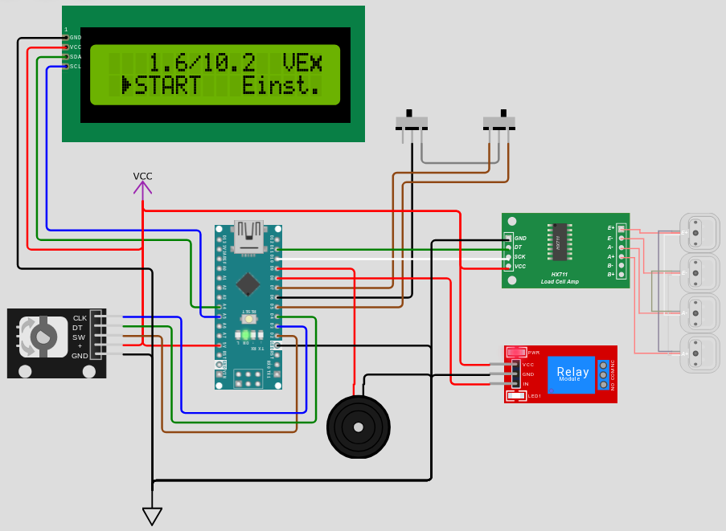

# Was ist Weight-O-Matic?
Weight-O-Matic ist ein kompaktes, einfach zu bedienendes, mikrocontrollergesteuertes Hilfsmittel auf Basis des AtMega 328P (Arduino Nano), um Prozesse, bei denen die Masse eines Objektes zunimmt, bei einem entsprechenden Soll-Wert anzuhalten. Es wurde speziell für den Anwendungsfall entwickelt, die Produktion einer Leitungswasser-Osmoseanlage anzuhalten, nachdem ein entsprechender Kanister am Ausgang vollständig gefüllt wurde.  

Das System bietet die Möglichkeit, das Gewicht des Wasserkanisters mittels einer Waage zu überwachen und entsprechend eines Sollwertes einen elektrischen Ausgang anzusteuern. In diesem Anwendungsfall ist an den Ausgang ein (stromlos geschlossenes) Magnetventil angeschlossen, welches den Wasserausgang der Osmoseanlage schließt - wodurch sich diese ausschaltet.

***Hinweis:** Das Projekt ist aktuell noch Work-In-Progess! Es könnten noch weitreichende Änderungen erfolgen.*

# Was ist in diesem Repo?
Hier befinden sich alle Projektdateien:
- Im Unterordner `Weight-O-Matic_FW` ist das PlatformIO-Projekt für die Firmware des Mikrocontrollers zu finden.
<!-- - Der Ordner `Bedienungsanleitung` beinhaltet ebendiese als pdf-Datei. Ist noch ziemlich unvollständig. -->
- Unter `Zustandsdiagramm` ist die [abstrakte Darstellung der Menüzustände](Zustandsdiagramm/state_diagram.png) im PlantUML-Format und als PNG zu finden.
- Im Ordner `Weight-O-Matic_HW` befindet sich der Schaltplan (KiCad-Projekt) bzw. weitere Informationen zur verwendeten Hardware.
- `assets` beinhaltet alle Artefakte, die von diesem Readme oder in der Bedienungsanleitung eingebunden werden.

# Wie kann man das ausprobieren?

Mit [Wokwi](https://wokwi.com/) kann Weight-O-Matic simuliert werden, um es auch ohne Hardware ausprobieren zu können!

Link: https://wokwi.com/projects/409734208353140737

**Hinweise zur Simulation mit Wokwi**:
- Manchmal wird beim Starten der Simulation ein Fehler angezeigt, da die Verbindung mit der simulierten Wiegezelle nicht hergestellt werden kann. In diesem Fall hilft das Drücken des Reset-Buttons auf dem Arduino Nano.
- Da Wokwi keine 3-Positionen-Schalter zur Verfügung stellt, ist der VE-Wahlschalter durch zwei separate Schalter dargestellt. Der linke wählt, ob eine VE aktiviert werden soll, der rechte Schalter wählt dann zwischen den zwei VE.
- Beim ersten Starten ist das EEPROM im Simulator nicht richtig initialisiert. Dann werden sinnlose Zahlen bei den Voreinstellungen als Tara-Versatz bzw. Sollwert angezeigt. In diesem Fall bitte einmal über das Einstellungsmenü den Punkt "RST" wählen, um das simulierte EEPROM mit den Standardwerten zu überschreiben. Da das danach folgende Software-Reset des Mikrocontrollers in der Simulation nicht funktioniert, ist der Reset-Button auf dem Arduino Nano zu betätigen!
- Die Standardwerte für die Kalibrierung der Waage sind für die Simulation ungeeignet. Am besten deshalb nach dem soeben beschriebenen Reset auch direkt eine Kalibrierung vornehmen!

# Lizenz

Siehe [LICENSE](LICENSE)!